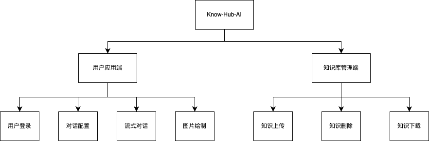
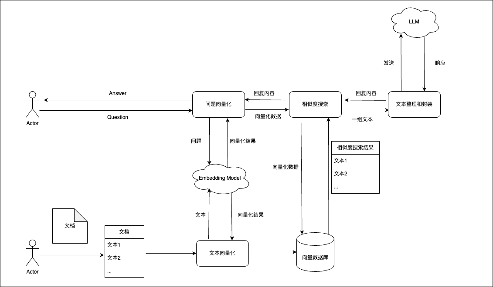
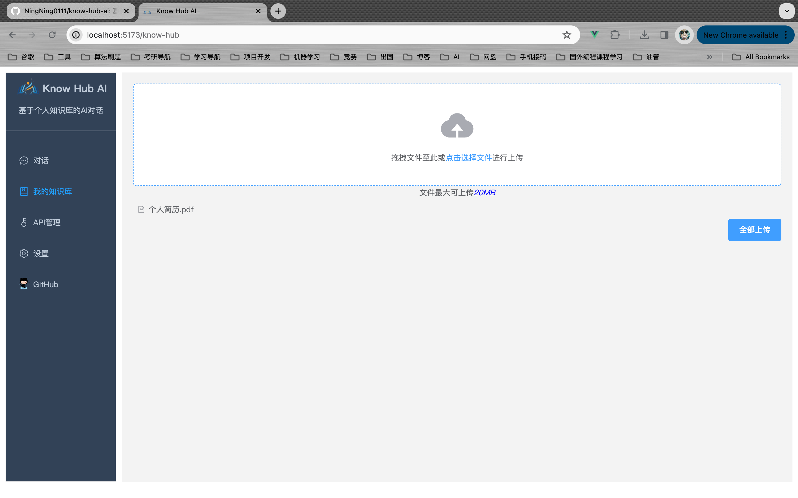
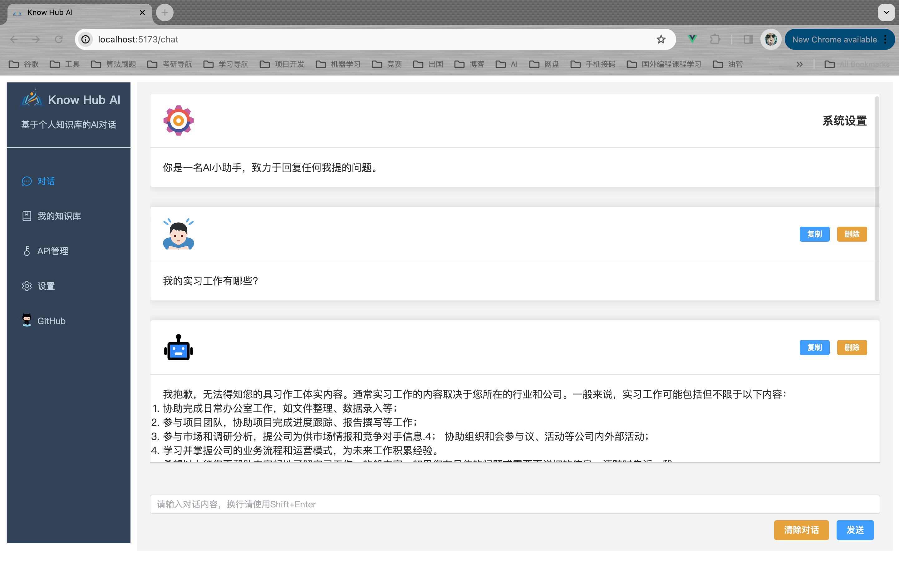
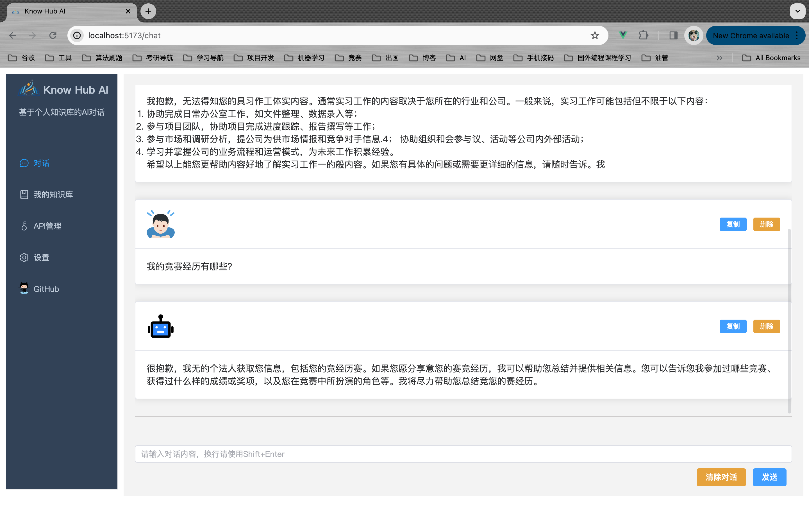
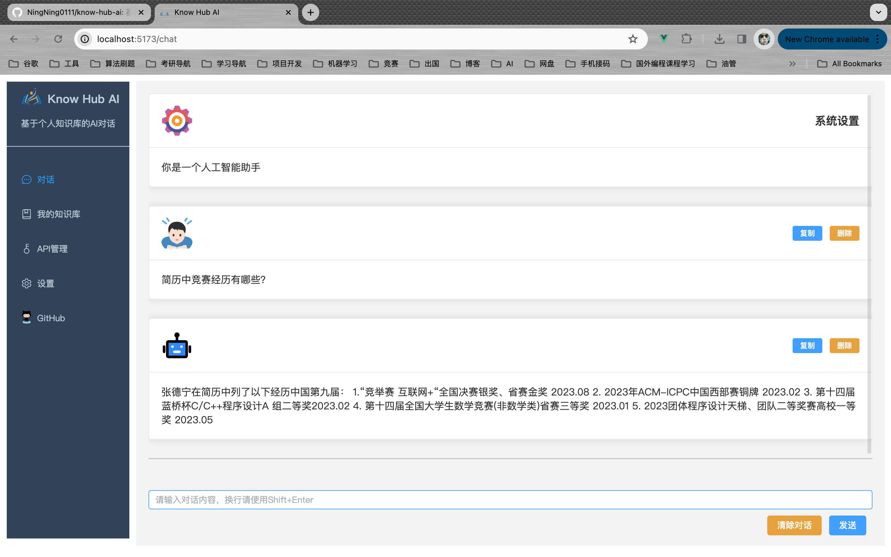
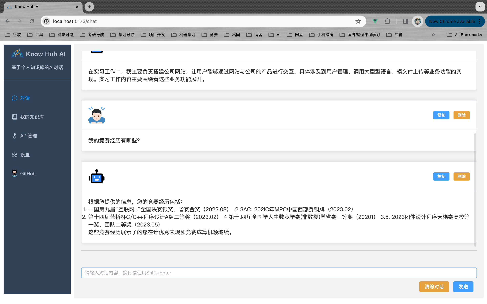
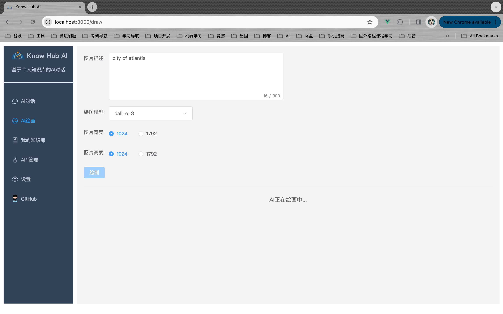
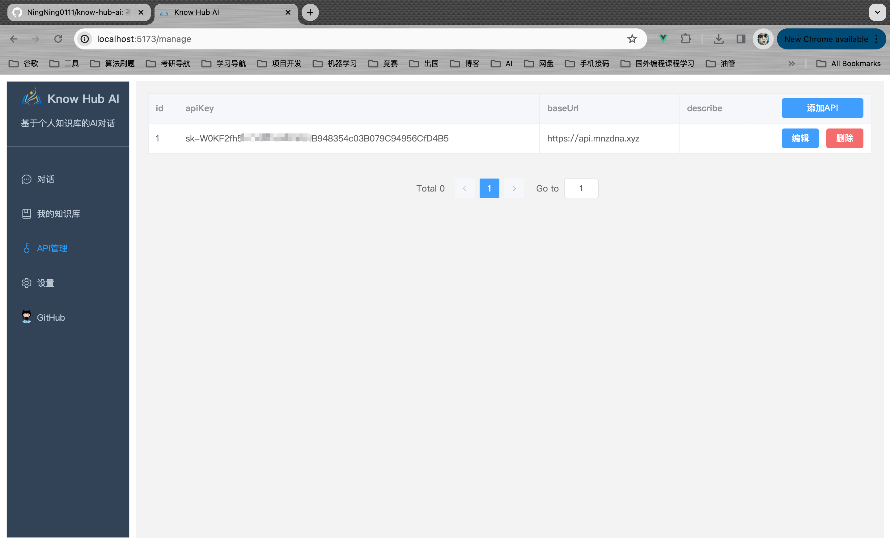
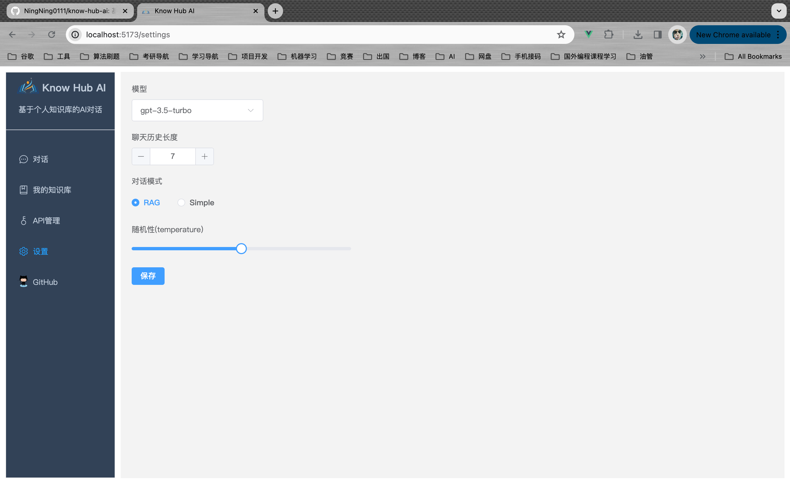

## 项目介绍

&emsp;[know-hub-ai](https://github.com/NingNing0111/know-hub-ai)是一款采用[RAG 技术](https://www.promptingguide.ai/zh/techniques/rag)实现的个人知识库 AI 问答系统，本项目适配 OpenAI 接口，因此可搭配[One-API](https://github.com/songquanpeng/one-api)实现大语言模型的统一调用。

&emsp;🌟🌟**请将本项目视为一个 Spring AI 和 RAG 技术的学习项目，本项目重在介绍 Spring AI 的使用以及结合向量数据库实现 RAG 技术的实现**。

## 项目功能

- [x] 知识库上传，支持：**pdf、doc、txt、md、excel**等文件格式
- [x] 支持两种方式的 AI 对话：RAG 和 Simple
  - RAG：对话前会检索知识库作为上下文，AI 可以根据检索出的知识库内容进行回复；
  - Simple：普通对话
- [x] 聊天配置：可设置最大聊天历史长度、对话模型、对话方式、系统提示词等
- [x] API 管理：添加或删除 API
- [x] AI 绘图(Dall-e-\*)系列
- [x] 对象存储：知识库的文件存储在云上，目前选定开源软件[Minio](https://github.com/minio/minio)作为对象存储平台
- [x] 知识库下载：基于对象存储的实现

## 开发计划

- [ ] 基于语音输入实现对话

- [ ] Api 分类管理：（embedding、image、chat 等三类模型），接口统一为 OpenAI

- [ ] MJ 绘图

- [ ] 桌面应用端开发

- [ ] 多用户的后端服务

## 功能模块图



## 工作原理



## 技术栈

### 前端

- node >= 18
- Vue3 + TS + ElementPlus + Pinia

### 后端

- JDK >= 17
- Spring Boot 3.x
- Spring AI 0.8.1
- pgvector 0.5.0

## 效果图

### 知识库管理

> 支持：PDF、doc、md、excel 等



### 正常对话(不使用知识库)





### RAG 对话(使用知识库)





### AI 绘画




### API 管理



### 设置中心



## 部署指南

&emsp;Mac M1 环境(ARM)，使用`docker-compose-mac.yml`一键本地部署

```shell
docker compose -f docker-compose-mac.yml up -d
```

&emsp;Linux(AMD)使用`docker-compose.yml`一键部署

```shell
docker compose up -d
```

### 说明

&emsp;若只想搭建项目环境，可以使用这个[docker-compose.yml](https://github.com/NingNing0111/know-hub-ai/blob/master/know-hub-ai-backend/env/docker-compose.yml)文件，执行下述命令即可部署 pgvector 和 minio：

```
docker compose up -d
```

&emsp;项目采用 Spring Data JPA 作为 ORM 框架，本地开发时，可通过在`application.yml`文件中配置`spring.jpa.hibernate.ddl-auto`为`create`(项目下载后默认配置)即可在 SpringBoot 启动时自动创建表。

## 其它

- knife4j 接口文档：[http://localhost:8329/doc.html](#)
