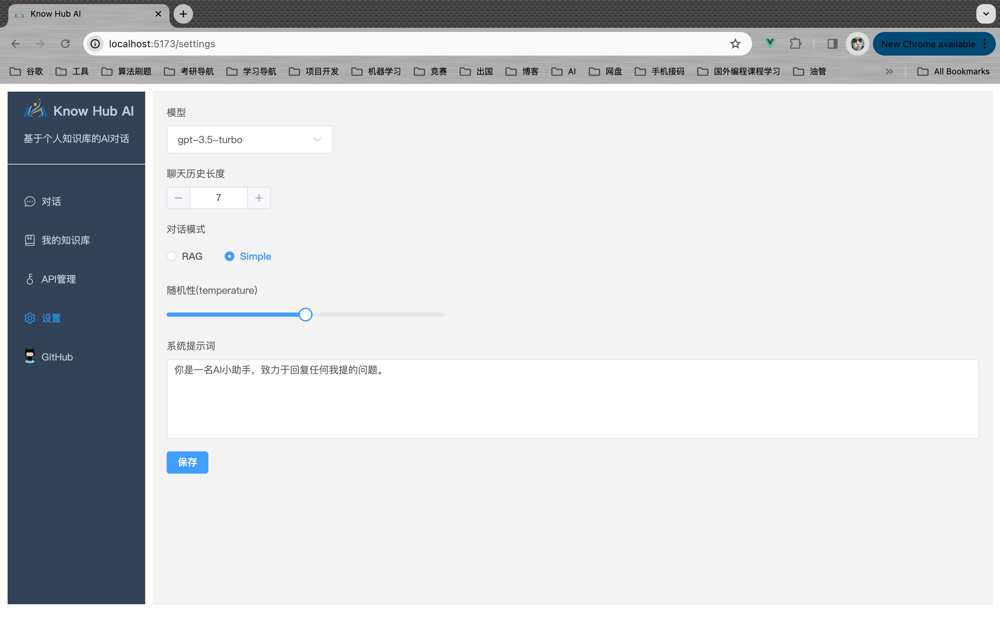

## 功能模块图

## 工作原理

## 技术栈

### 前端

- node >= 18
- Vue3 + TS + ElementPlus + Pinia

### 后端

- JDK >= 17
- Spring Boot 3.x
- Spring AI 0.8.1
- pgvector 0.5.0

## 效果图

### 知识库管理

> 支持：PDF、doc、md、excel 等

### 正常对话(不使用知识库)

### RAG 对话(使用知识库)

### API 管理

### 对话设置

