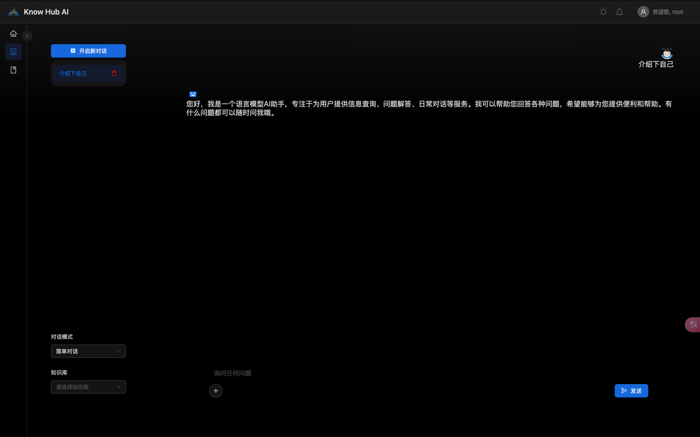
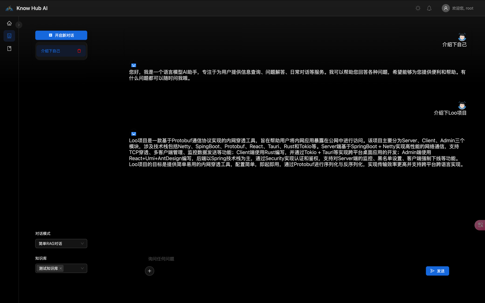
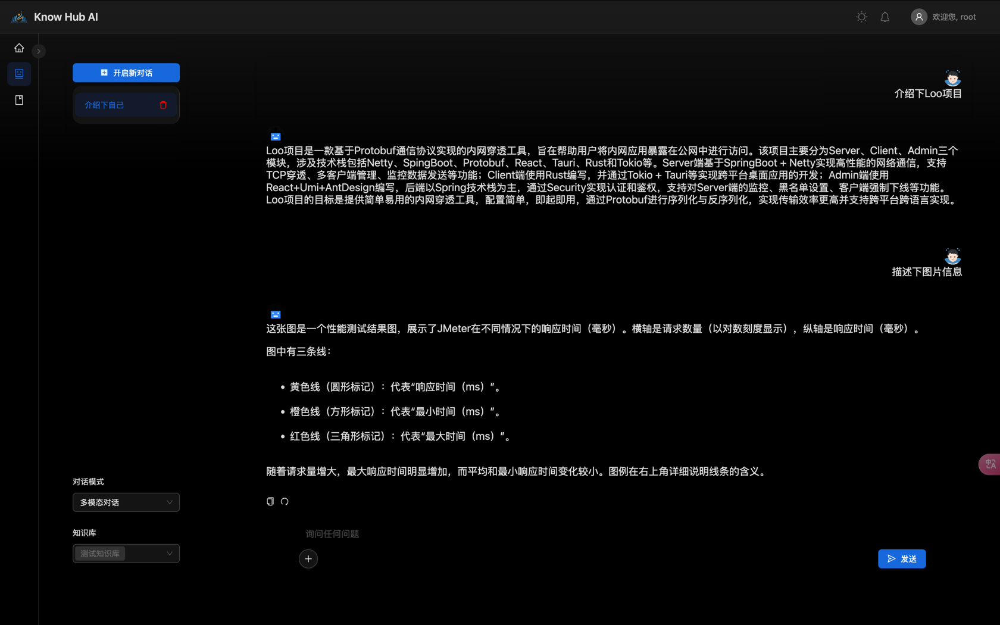
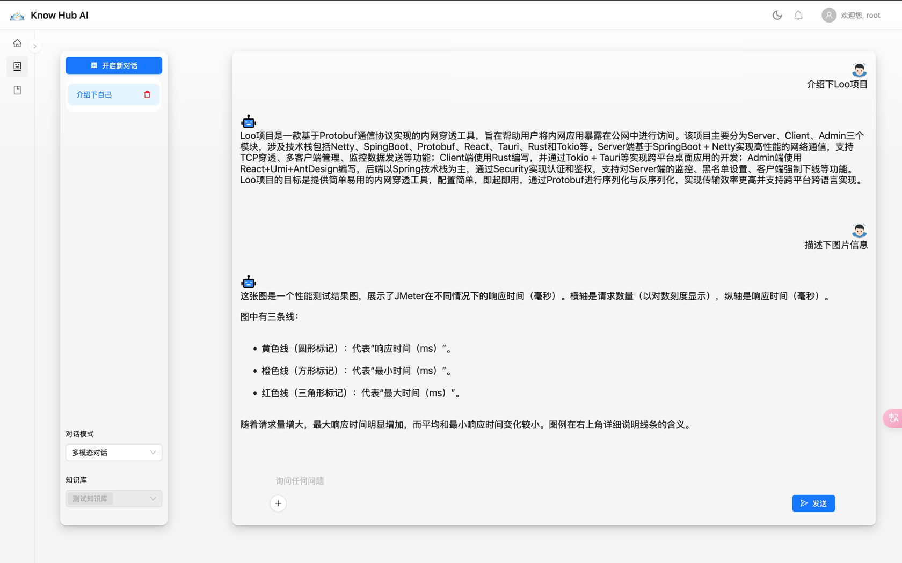

# 说明

&emsp;使用SpringAI 1.x版本对项目进行重构,**旧版本详见分支**[0.8-vue](https://github.com/NingNing0111/know-hub-ai/tree/0.8-vue)：

- 前端：React + Umi.js
- 后端：SpringAI 1.x

功能集中实现实现知识库分离，文档分离，支持指定某个知识库进行RAG对话、多模态对话。

## 项目介绍

&emsp;[know-hub-ai](https://github.com/NingNing0111/know-hub-ai)是一款采用[RAG 技术](https://www.promptingguide.ai/zh/techniques/rag)实现的个人知识库 AI 问答系统，本项目适配 OpenAI 接口，因此可搭配[One-API](https://github.com/songquanpeng/one-api)实现大语言模型的统一调用。

&emsp;🌟🌟**请将本项目视为一个 Spring AI 和 RAG 技术的学习项目，本项目重在介绍 Spring AI 的使用以及结合向量数据库实现 RAG 技术的实现**。

## TODO 

### 后端工作

- [x] 对话附件上传接口：多模态需要。文档或图片上传时返回id，携带该id发起对话，Media 在后端根据id构建。
- [x] `DatabaseChatMemory` 实现：Message 存储到数据库中
- [x] 知识库增删改查接口：添加知识库、删除知识库、知识库列表
- [x] 知识库附件上传接口：指定知识库（携带id）上传，将文档存储到向量数据库（meta记录知识库id-baseId），同时生成附件文档对象。
- [ ] 知识库下的附件文档删查接口：在指定知识库下，可以删除附件、查询附件。
- [x] 对话信息接口：创建对话、查询对话信息
- [x] 非多模态RAG对话: 指定多个知识库进行对话
- [ ] 多模态RAG对话
- [x] 简单对话
- [x] 多模态简单对话

### 前端工作

- [x] 对话界面: 快速搭建
- [x] 知识库管理界面
- [ ] 知识库下附件管理界面

## 开发流程

> 重构代码均在new分支上，待开发完毕才会合并到master上。

- fork整个项目，包含new分支
- 拉去项目:`git clone -b new 仓库地址`

为了保证代码格式统一，需要在提交代码前，执行插件`spring-javaformat:apply`对整个项目的代码进行格式化。

## 效果

### 非多模态对话

### 非多模态RAG对话（指定特定知识库）

### 多模态对话

