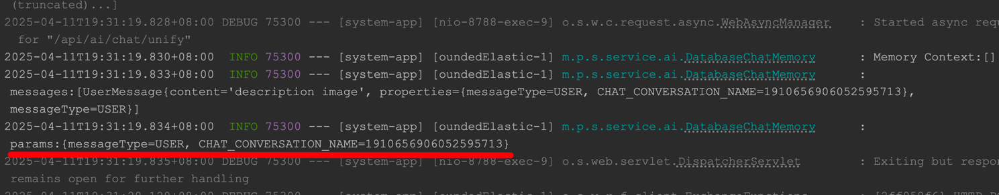

**Bug description**

&emsp;I am trying to record some meta information in the UserMessage object using the code below, but in the ChatMemory implementation class, I cannot access the data recorded in the meta.


```java
	@Override
	public Flux<ChatResponse> multimodalChat(ChatMessageVO chatMessageVO) {
		ChatModel chatModel = llmService.getMultimodalModel();
		List<String> resourceIds = chatMessageVO.getResourceIds();
		ChatClient chatClient = ChatClient.builder(chatModel).build();
		return chatClient.prompt().user(user -> {
			HashMap<String, Object> params = new HashMap<>();
			params.put(CHAT_CONVERSATION_NAME, chatMessageVO.getConversationId());
			params.put(CHAT_MEDIAS, chatMessageVO.getResourceIds());
			user.params(params);
			user.text(chatMessageVO.getContent());
			log.info("params:{}", params);
			if (resourceIds != null && !resourceIds.isEmpty()) {
				List<Media> medias = originFileResourceService.fromResourceId(resourceIds);
				user.media(medias.toArray(new Media[0]));
			}
		})
			.advisors(new SimpleLoggerAdvisor(),
					MessageChatMemoryAdvisor.builder(databaseChatMemory)
						.conversationId(chatMessageVO.getConversationId())
						.chatMemoryRetrieveSize(CHAT_MAX_LENGTH)
						.build())
			.stream()
			.chatResponse();
	}
```

`ChatMemory`:

```java
	@Transactional(rollbackFor = Exception.class)
	@Override
	public void add(String conversationId, List<Message> messages) {
		log.info("messages:{}", messages);
		log.info("params:{}", messages.get(0).getMetadata());
		LambdaQueryWrapper<ChatMessage> qw = new LambdaQueryWrapper<>();
		qw.eq(ChatMessage::getIsClean, false);
		qw.eq(ChatMessage::getConversationId, conversationId);
		Long cnt = this.chatMessageMapper.selectCount(qw);
		ArrayList<ChatMessage> chatMessageList = new ArrayList<>();
		for (int i = 0; i < messages.size(); i++) {
			Message message = messages.get(i);
			ChatMessage chatMessage = new ChatMessage();
			chatMessage.setConversationId(conversationId);
			chatMessage.setMessageNo((int) (cnt + i + 1));
			chatMessage.setContent(message.getText());
			chatMessage.setRole(message.getMetadata().get(MESSAGE_TYPE).toString());
			List<String> resourceIds = (List) message.getMetadata().get(AppConstant.CHAT_MEDIAS);
			if (resourceIds != null && !resourceIds.isEmpty()) {
				chatMessage.setHasMedia(true);
				chatMessage.setResourceIds(resourceIds);
			}
			else {
				chatMessage.setHasMedia(false);
				chatMessage.setResourceIds(List.of());
			}
			chatMessageList.add(chatMessage);
		}
		chatMessageMapper.insert(chatMessageList);
	}
```

**Log:**




- PR:[2704](https://github.com/spring-projects/spring-ai/pull/2704)
